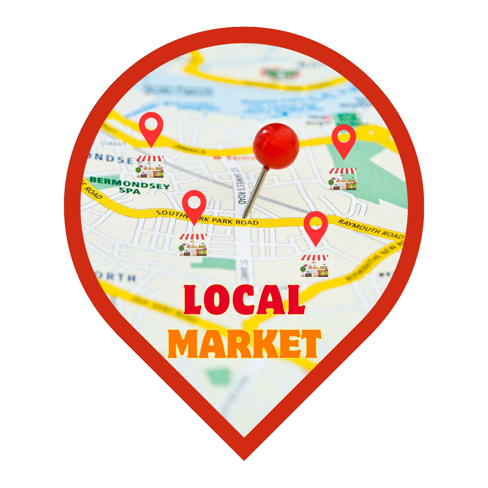

# local_market

  

LocalMarket es un proyecto creado a apartir de una idea de presentacion como proyecto Intregrador de Saberes (PIS) en el Instituto Superior Tecnologigo Babahoyo (ISTB). LocalMarket es un proyecto dedicado tanto a los clientes como a los comercios locales dentro de un area determinada, este proyecto Movil/Web tiene como fin conectar a estas dos entidades para encontrar un benificio mutuo entre ambos, tanto para los comercios locales en forma de tener mas visualizacion en su entorno como para los clientes al poder examinar los negocios locales en busca de sus productos deseados desde una misma ubicacion. LocaMarket intrega recursos de google maps mediante su API, como BackEnd utiliza una api rest desarrollada en php **API_local_market** y como herramienta adicional en modo desarrollo utilza una herramientra extra **SkyLocal**.

## Índice

- [Instalación](#Instalación)
- [Recursos](#Recursos)
- [Uso](#uso)
- [Autores](#autores)

## Recursos 

   ### API_local_market
Clona y configurar la API que servira como backend del proyecto.

   - [Repositorio de la API](https://github.com/Litardo-Jardy/API_local_market)

   ### SkyLocal
Clona y configura una herramienta fundamental que permitira guardar los recursos como imagenes, videos, documentos, etc.. en tu almacenamiento local.

- [Repositorio de la herramineta](https://github.com/Litardo-Jardy/SkyLocal)

## Instalacion
   Cuando ya tengas todos los recursos previamente clonados en tu maquina sigue los siguientes pasos para instalar correctamente LocalMarket:

   ### Previamente necesitas tener las herramientas para ejecutar flutter en tu maquina

   - [Guia para descargar y configurar flutter en window](https://docs.flutter.dev/get-started/install/windows/web)
   - [Guia para descargar y configurar flutter en linux](https://docs.flutter.dev/get-started/install/linux/web)
   - [SDK Tools android studio](https://developer.android.com/tools/releases/platform-tools)

   O si estas trabajando en **Android Studio** simplemente habilita un emulador para el proyecto y salta al siguiente paso.

   ### Clona el repositorio
    
`https://github.com/Litardo-Jardy/LocalMarket.git`

   ### Crea y configura un archivo config.dart

    class Config {
          static const String apiKey = 'http://localhost API_local_market'; 
          static const String apiMaps = 'Tu API KEY de google maps';
    } 

   ### Actualiza las depencias del proyecto
   Ejecuta en la raiz del proyecto el csiguiente comando:

`Flutter pub get`
    

## Uso
  
  - [Manual de usuario](https://docs.google.com/document/d/1b3shJ8cJTNlyHOLxJoXlaiYzfGiDjF8-/edit?usp=drive_link&ouid=117070540111661688867&rtpof=true&sd=true)
  - [Otros recursos relevantes](https://drive.google.com/drive/folders/1ZGYOHQ0dJmDVPFntFOygyxSj9QXDWG8t?usp=drive_link)

## Autores

  ### Principal contribuidor
   #### Programador FrontEnd y BackEnd:
   - Jardy Litrado [@Jardy](https://github.com/Litardo-Jardy)

  ### Colaboradores

   #### Diseño:
   - Jonnathan Alvarez [@jalvarex](https://github.com/jalvarex)
   - Arturo Troya [@Arturo](https://github.com/ArturoTroya)
   - Marlon Flores [@TheCMFA](https://github.com/TheCMFA)
   - Ruben Mora [elbenjack128](https://github.com/elbenjack128)

   #### Documentacion:
  - Marlon Flores [@TheCMFA](https://github.com/TheCMFA)
  - Jonnathan Alvarez [@jalvarex](https://github.com/jalvarex)
  - Lester Domingues
  - Omar Araujo

    #### Testing:
    - Ruben Mora [elbenjack128](https://github.com/elbenjack128)
    - Jonnathan Alvarez [@jalvarex](https://github.com/jalvarex)
    - Jardy Litrado [@Jardy](https://github.com/Litardo-Jardy)

  

